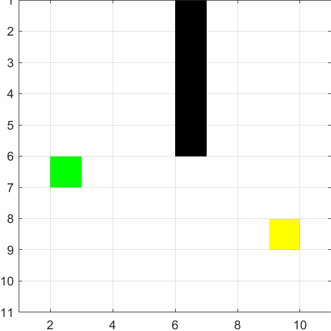
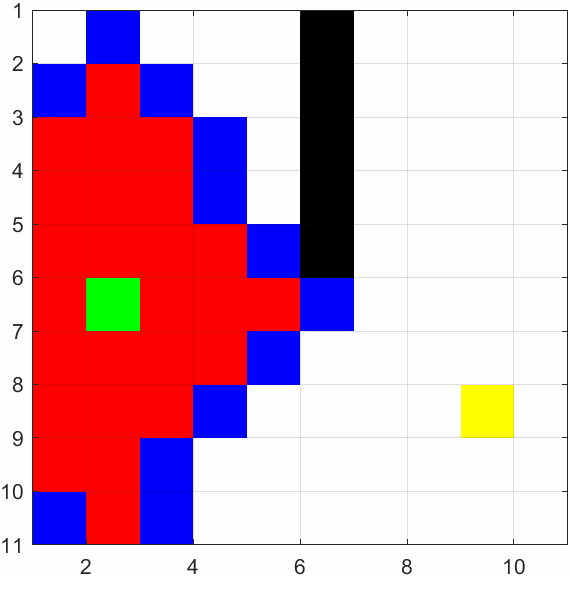
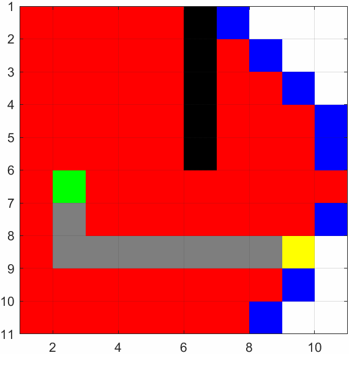

#  Search based Motion Planning for a grid based environment
Implemented a search based motion planning algorithm, namely Dijkstra's algorithm in a grid based environment for map based Mission-Planning

How to run the code:
1. The DijkstraGrid.m file contains the Dijkstras algorithm.
2. Run the Test_codes.m file to run the Dijkstras algorithm on a set grid.
3. Change the start and end position and size of the grid for custom environment.

The environment for the robot and the obstacles in a 2D grid based environment.
The custom grid environment has been shown below.

## * Simulation of the Dijkstra's algorithm *
The red nodes denoted visited nodes. The blue denote explored nodes and the green and yellow nodes denotes start and goal nodes.

The following gif shows how the nodes are visited and the planned path.

The final found path is shown below.

